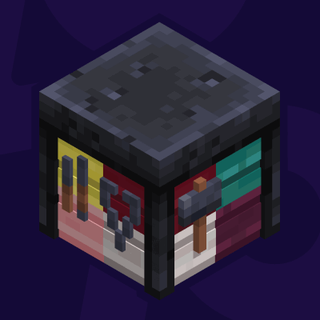

#  More Smithing Tables
> 
>
> A simple mod adding wood variants for Minecraft's Smithing Table Block.

### Compatibility

- Minecraft: `1.20.1`, `1.21(.1)`, `1.21.4`~`1.21.10`
- Mod Loader: _Fabric_
- Requires: [`Fabric API`](https://modrinth.com/mod/fabric-api)

### ᴬ⃯ ᵦ⃔ Translations

Currently available in:
- English
- German

Want to help translate? Feel free to open a PR to the **default branch (`1.21(.1)`)**.

### Changelog History

<!--CHANGELOG:START-->

<!--CHANGELOG:END-->

> _`The section above is automatically updated with each new release and only includes already published releases.`_
---
#### Support/Contact
- Suggestions? Questions? Bug reports?  
  Feel free to [open an issue](https://github.com/pnk2u/More-Frame-Variants/issues)!  
  &nbsp;  
  You can also contact me via email at [contact@pnku.de](mailto:contact@pnku.de) or join the [Discord](https://dsc.lieonlion.dev) and contact me there.
